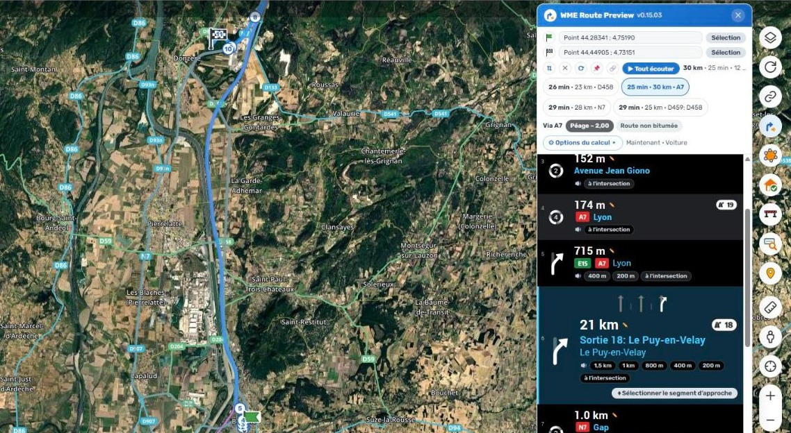
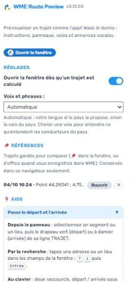

# WME Route Preview (WRP)

Voir, dans WME, un trajet **tel que l'appli Waze le donnera au conducteur** : chaque instruction comme dans la liste de l'appli — écussons, panneaux de sortie, voies, ronds-points — et **chaque annonce vocale dite par la vraie voix de Waze**, y compris les instructions personnalisées posées par les éditeurs.

C'est l'outil pour vérifier ce qu'on vient de poser (une instruction de virage, un panneau, des voies) sans prendre la voiture.

## Poser le départ et l'arrivée

| Où | Comment |
|---|---|
| **Panneau d'un segment ou d'un lieu** | une ligne **TRAJET** sous l'en-tête : drapeau vert (départ), drapeau à damier (arrivée) |
| **Fenêtre du script** | recherche d'une adresse ou d'un lieu (le service de la barre « Rechercher » de WME) |
| **Clavier** | deux raccourcis « départ / arrivée sous le pointeur », sans touches par défaut : Paramètres › Raccourcis clavier |

Le calcul part dès que les deux sont posés. La fenêtre s'ouvre par le bouton ajouté dans la colonne de droite de la carte ; elle se déplace et se redimensionne, sans jamais passer sur les boutons de la carte.

## Ce qu'on y lit

- **La liste « Étapes suivantes » de l'appli** : icône, distance, panneau ou rue. Un clic sur une ligne la déplie comme le bandeau de l'appli (bande de voies, pastille « puis ») et centre la carte sur l'intersection. ✎ signale une instruction posée par un éditeur.
- **Les panneaux et écussons que le serveur prépare pour l'appli**, sur tout le trajet, et les voies et textes vocaux des intersections hors de la vue, lus dans les données de WME.
- **Les annonces vocales** (puces 🔊, ou ▶ Tout écouter pour enchaîner le trajet), dans la langue de la voix du pays ou d'une voix choisie : anglais, français, allemand, espagnol, italien, portugais, néerlandais, hébreu.
- **La fiche du trajet** : via, péage, zones traversées (ZFE, zones à permis…), contournements.
- **Les options du calcul**, comme l'écran « Navigation » de l'appli : heure de départ (à l'heure du lieu), véhicule, péages, autoroutes, ferries, routes non bitumées, intersections difficiles, pass du pays.
- **Les autres itinéraires** proposés par le serveur, au choix ; les autres restent en gris sur la carte.

## Vérifier une modification

- **Avant / après** : 📌 garde le trajet comme référence — d'office quand on enregistre dans WME, puisque le trajet affiché a été calculé avant. Chaque calcul suivant entre les mêmes départ et arrivée lui est comparé : lignes modifiées (l'infobulle dit ce qu'il y avait) ou nouvelles, instructions disparues, durée. Le calcul de Waze ne voit une modification qu'une fois la carte publiée mise à jour par Waze : c'est à ce moment-là qu'il faut recalculer. Les références restent dans le navigateur, listées dans l'onglet Scripts.
- **Tester un virage** : sélectionnez deux segments qui se rejoignent ; la ligne du panneau propose « Tester ». Le trajet va de l'un à l'autre et dit s'il prend le virage, et avec quelle instruction.
- **Sélectionner le segment d'approche** d'une instruction, depuis sa ligne dépliée : ses voies et ses flèches de virage sont là.
- **Partager** : 🔗 copie un lien WME qui redonne le même trajet et les mêmes options à qui a le script.

Conduite à gauche prise en compte (ronds-points et demi-tours en miroir).

## Ce qu'il faut savoir

- Le calcul est celui du serveur de Waze, sur la **carte publiée** : une modification non enregistrée n'y paraît pas.
- Les phrases dites sont **recomposées** à partir des règles de l'appli ; hors anglais et français, les formulations des ronds-points, des distances et de l'arrivée n'ont pas pu être comparées à l'appli.
- Les paliers d'annonce (1,5 km, 1 km, 800 m, 400 m, 200 m, à l'intersection) suivent le planificateur local de l'appli ; l'appli peut aussi recevoir ses annonces du serveur, ou être réglée en mode bref, et parler moins souvent.
- La voix et la recherche passent par des appels internes de WME (pas le SDK) : si WME les change, le script le dit.

## Ce qu'il ne fait jamais

Aucune modification de la carte : aucune action n'entre dans la pile d'annulation de WME.

## Installation

Depuis GreasyFork (Tampermonkey ou Violentmonkey) : les mises à jour arrivent ensuite toutes seules. Retours et idées : [Issues](https://github.com/DrSlump34/WME-Route-Preview/issues). Historique des versions : [HISTORIQUE.md](HISTORIQUE.md). Licence MIT.

Pour les contributeurs : `node tools/check-idents.js WME-Route-Preview.user.js` (toute fonction appelée est déclarée), `node tools/rejouer-bancs.js` (rejoue les trajets enregistrés de `bancs/` sur le script et compare à `bancs/attendu/`) `node tools/banc-nouveautes.js` (itinéraires, comparaison à une référence, virage testé) et `node tools/banc-direction-ecusson.js` (écussons de la ligne « en direction de »).
